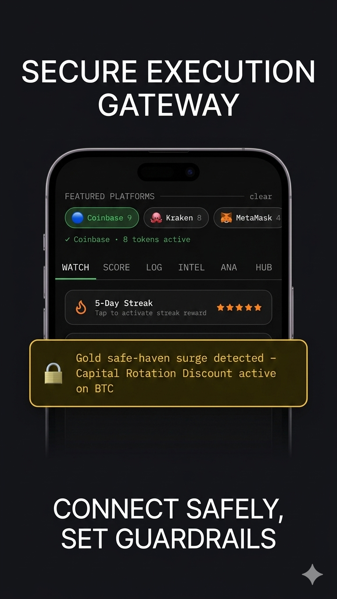
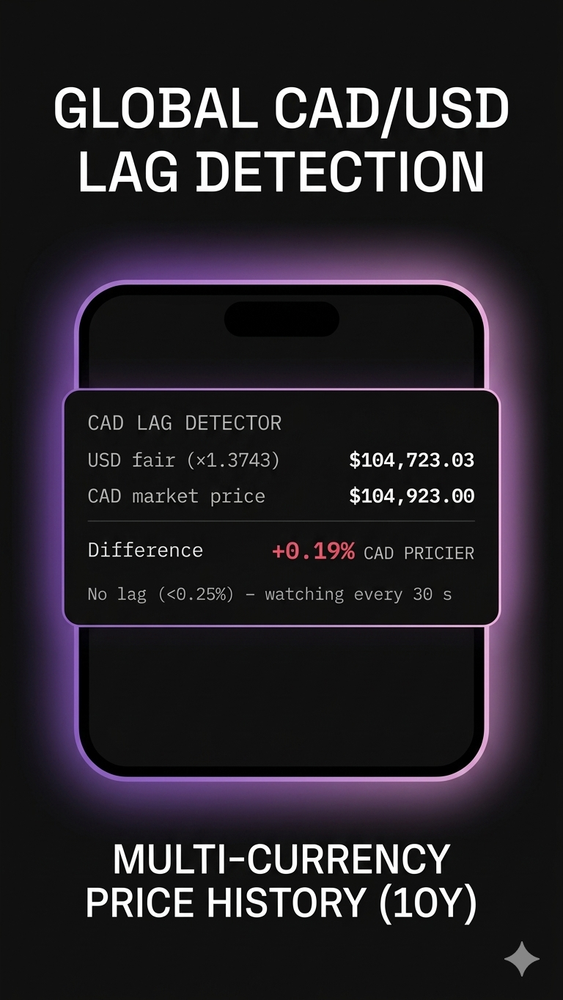
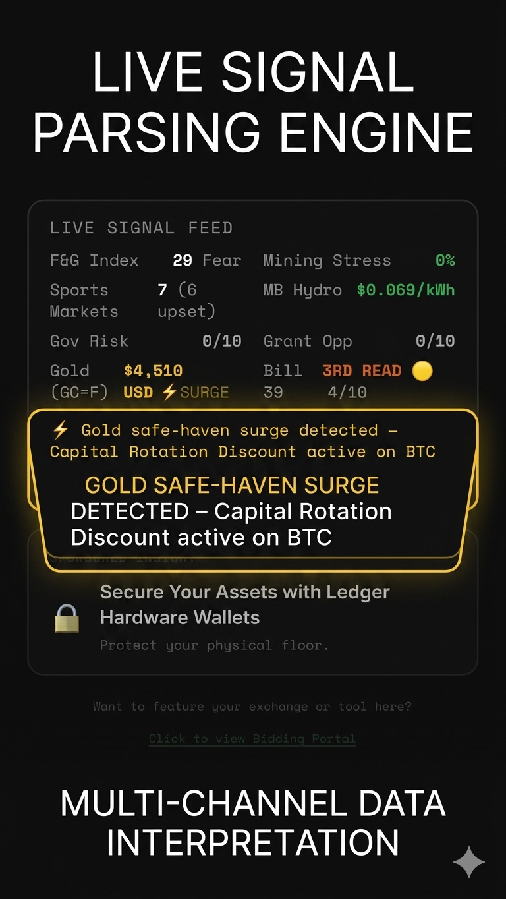

<!DOCTYPE html>
<html lang="en">
<head>
    <meta charset="UTF-8">
    <meta name="viewport" content="width=device-width, initial-scale=1.0">
    <title>Phaedra Aegis | Risk Guardian</title>
    
</head>
<body>
    

        <h1>Phaedra Aegis</h1>
        
Complex Volatility, Simplified.

        
        
An automated, non-custodial risk execution shield built for investors who don't speak numbers. Experience a calm desk while the system monitors market weather, manages guardrails, and defends your capital.

        

            
🛡️ Beta Spot Secured! Welcome to the Guardrail.

            

            <form id="beta-form" class="form-group">
                <input type="email" id="email" name="email" class="email-input" placeholder="Enter your email address" data-fs-field required>
                
                <button type="submit" class="btn" data-fs-submit-btn>SECURE MY BETA SPOT</button>
            </form>
        

        <h2 style="margin-top: 30px; margin-bottom: 15px; font-size: 1.4rem; letter-spacing: 1px;">CORE FEATURES</h2>

        

            
Automated Wallet Execution

            
Connect safely via restricted APIs. The system handles protective buy/sell execution the second boundaries are crossed.

            
        

        

            
Real-Time Signal Parsing

            
Automated keyword detection across authorized channels and market weather feeds.

            
        

        

            
Global Currency Translation

            
Built-in CAD Lag Detector and multi-language localization parameters for borderless tracking.

            
        

        
        

            <strong>⚖️ PHAEDRA AEGIS: REGULATORY, EXECUTION & PRIVACY COMPLIANCE MANDATE</strong>  
            Phaedra Aegis is a proprietary automated algorithmic execution, risk-management, and analytical support interface. By initializing this application, providing an account email address, and selecting a local region, you explicitly authorize the platform to utilize these data points solely to personalize localized market weather alerts, track macro data infrastructure, and display native localized currency matrices. Users maintain the absolute right to account termination and may request the permanent deletion of their account metadata and registration email from our secure authentication records at any time. Phaedra Aegis is a non-custodial interface; it does not hold, store, or maintain direct access to your private cryptographic keys, seed phrases, or external exchange credentials. By actively connecting third-party digital wallets or exchange API keys to this interface, you grant explicit authorization for Phaedra Aegis to automatically deploy and execute buy and sell orders on your behalf, based entirely on the custom allocation parameters, risk guardrails, and system thresholds configured within your local user settings. This software functions strictly as a neutral, user-directed execution interface; it does not analyze individual investor suitability, offer tailored investment strategies, or provide personalized financial, legal, tax, or investment advisory services. You acknowledge that automated execution involves severe inherent risks, including network latency, API disconnects, market slippage, and sudden liquidity shocks; the developer assumes no financial or legal liability for execution delays, unexpected market movements, or losses resulting from automated trading logic. To deliver real-time localized tracking, this application utilizes user-authorized background parsing tools to scan specified inbound text message keywords and user-forwarded data strings—including clipped information from restricted networks such as Facebook groups. This background string-parsing is executed strictly in real-time on your local device to trigger automated alerts; no private conversational text or contextual social data is scraped, logged, or transmitted to external databases. All fiat banking connectivity, payment interactions, and subscription processing are routed through secure, end-to-end encrypted third-party financial gateways including Stripe and Plaid API architectures; Phaedra Aegis never reads, accesses, or retains raw banking credentials, account routing numbers, or credit card primary account details. All session tokens, parsed tracking preferences, and encrypted API configurations remain stored strictly within the localized, secure sandbox partition of the user’s host device. Past analytical performance or simulated trends do not guarantee future results. All automation parameters are operated independently and solely at the risk of the user.
    

    
    
</body>
</html>
